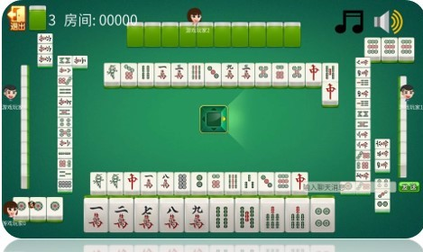
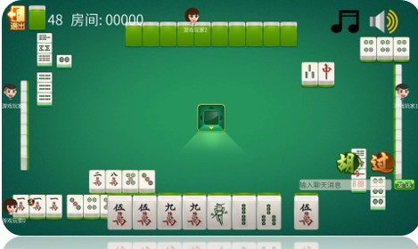

## 麻将游戏——客户端

## 简介

本工程使用Godot实现了一种开房间类型联网麻将游戏的跨平台客户端，需要与麻将服务器配合使用，游戏的主要逻辑都在服务器中实现，本客户端根据服务器发来的数据报来进行界面的显示、提示玩家操作，并将玩家进行的操作传送到服务器。

### 与服务器的通信方式

游戏中的通信采用WebSocket协议，其他部分采用HTTPS协议。

通信内容全部采用json格式。

### 场景

1. 登录、注册场景

   * 场景文件：`Login.tscn`
   * 脚本文件：`Login.gd`

2. 创建、加入房间场景

   * 场景文件：`Hall.tscn`

   * 脚本文件：`Hall.gd`

3. 牌桌场景

   * 场景文件：`Table.tscn`

   * 脚本文件：`Table.gd`

### 预览

### 素材

工程中的贴图、音效等素材均搜集自互联网。

## 开发环境

安装Godot Engine（3.2版本以上）

